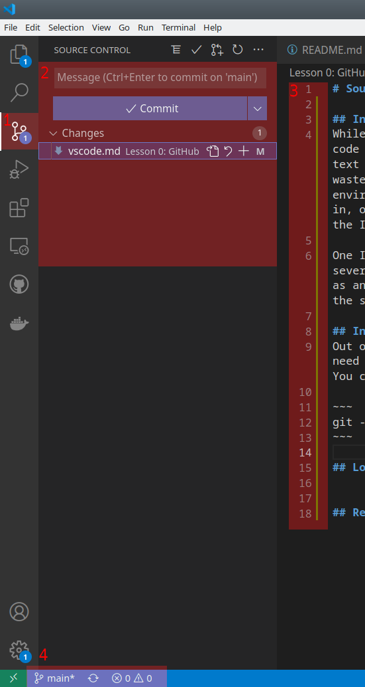

# Source Control in Visual Studio Code

## Introdution
While some developers want to flex by saying they only code using Vim, Emacs, Nano, or some other command line text editor, this way of thinking can be extremely wasteful. When using an IDE (integrated development environment), many quality of life features are built in, or can be added. After all, the people who created the IDE want a good experience writing code too!

One IDE that has gained a lot of popularity in the last several years is Visual Studio Code. This tutorial acts as an extension of the Git tutorial and shows how to use the source control built into VSCode.

## Installation
Out of the box, VSCode has Git support, though Git does need to be installed on your computer for this to work. You can check if Git is installed by running the command

~~~
git --version
~~~

## Local Usage
There are many features within the VSCode for managing repositories locally. This image will be referenced for locations of interface elements

1. On the image, area 1 is the source control tab (hotkey ctrl+shift+G). This will open area 2.

2. Area 2 has several elements. Above it are a few quick buttons
* View as tree/View as list - changes the view of the files to show them as a flat list, or in their file structure
* Commit

## Remote Usage